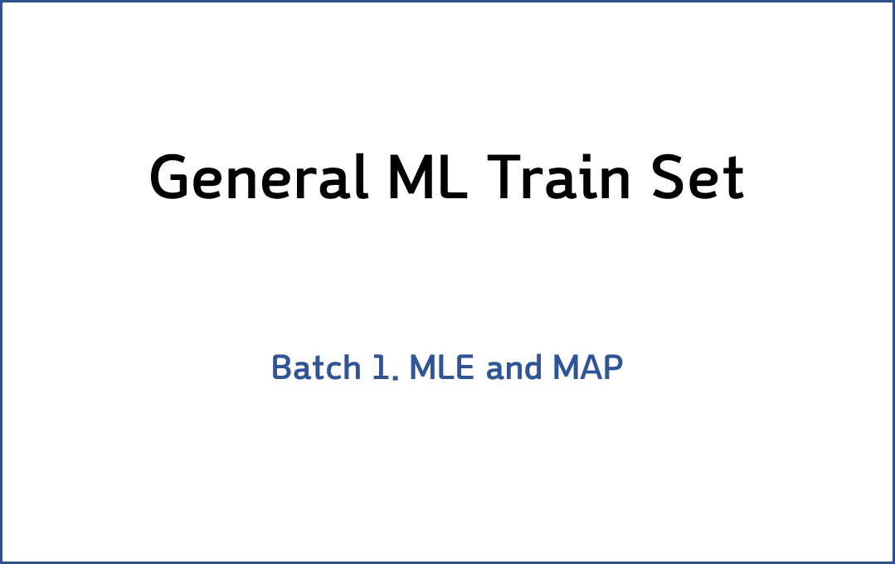
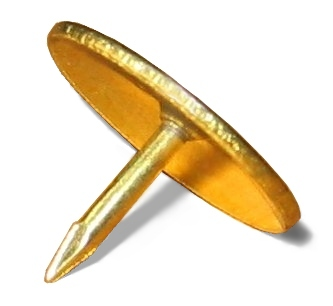

### MLE(Maximum Likelihood Estimation)와 MAP(Maximum a Posteriori)

> 파라미터를 추정하는 방법론 중 하나인 MLE와 MAP의 개념에 대해서 알아봅니다.

    

$$
\lim_{x\to 0}{\frac{e^x-1}{2x}}
\overset{\left[\frac{0}{0}\right]}{\underset{\mathrm{H}}{=}}
\lim_{x\to 0}{\frac{e^x}{2}}={\frac{1}{2}}
$$

>  **1. MLE와 MAP는 특정 확률분포, 혹은 머신러닝 모델의 파라미터를 추정하는 방법론이다**
>
>  **2. MLE는 파라미터 Θ(theta)가 주어졌을 때 우리가 가진 데이터셋이 발생할 가능성(likelihood)를 극대화하도록 유도하는 접근법이다**
>
>  **3. MAP는 **

 

----

#### Contents

 

1.	[압정 던지기 예시](#thumbtack-problem)
2.	[이항 분포](#binomial-distribution)
3.  [Maximum Likelihood Estimation](#MLE)
4.	[Simple Error Bound와 PAC learning](#simple-upper-bound)
5.	[사전지식 결합하기, 베이즈 정리](#incorporation-prior)
6.	[Maximum a Posteriori Estimation](#MAP)

 

### 압정 던지기 예시
어떤 도박장에서, 압정을 던지는 게임을 하고 있다고 생각해 봅시다. 만약 윗면(뾰족한 면이 위) 혹은 아랫면에 돈을 걸고 맞추면 2배의 돈을 벌게 됩니다.  

어떤 갑부가 찾아와서, 우리에게 과학적이고 엔지니어링적인 도움을 요청했다고 해봅시다. 아주 큰 돈을 주면서 말이죠! 갑부의 질문은 다음과 같습니다:  

압정을 던졌을 때 나오는 윗면이 확률은 어떻게되지?!  

    

이 질문에 답하기 위해, 우리는 아마 몇번 던져보는 시도를 먼저 해볼 것 같습니다.  

5번을 던졌더니 3/5가 윗면이 나오고, 2/5가 아랫면이 나왔다고 해 보죠. 이에 따라서 배팅하면 된다고 말해주면 되겠지만, 뭔가 찜찜합니다. 너무 감에 의존하는 것 같지 않나요?  

우리가 제시한 답이 정말 해답인지, 그렇다면 어떤 근거로 그 답이 최적이라고 할 수 있는지 한번 알아봅시다.  

그 전에, 먼저 알아야 할 몇 가지 개념들이 있습니다.

-----

### 이항 분포 (Binomial Distribution)  

이항 분포는 discrete probability distribution(이산적 확률 분포)의 하나로, 각 시행이 Θ의 성공 확률과 1-Θ의 실패 확률을 가질 때 n개의 독립된 시행을 통해 성공한 횟수가 따르는 분포를 이릅니다.  

간단히 말해, 압정 던지기와 같은 실험을 해볼 때, 3/5(앞에서의 Θ)의 확률로 윗면이 나올(정의에서의 "성공") 때, 압정을 100번(정의에서의 n)을 던졌을 경우 윗면이 나온(정의에서의 "성공") 횟수가 따르는 분포라는 말입니다.  

각 시행은 i.i.d (independent and identically distributed) 즉 독립적이고 동일하게 분포되어 있습니다. 다음의 특성을 말합니다.
  - independent한 시행: 이전의 압정 던지기가 다음에 영향을 미치지 않음
  - 베르누이 분포에 따라 identically distributed: 압정의 손상이 없어서 위와 아래가 일정한 확률로 출현함  

자, 이제 우리의 압정 던지기 문제로 돌아가 봅시다. 이항 분포를 설명한 것은 압정 던지기라는 시행이 따르는 분포가 이항분포이기 때문이라는 것을 눈치 채셨을 것입니다.  

  - head가 나올 경우를 승으로 간주하고, 그 확률이 Θ라고 할 때, D(즉 우리가 가진 Dataset)=HHTHT라는 결과가 나왔다고 해 봅시다.
	- 이런 상황이 나올 확률을 계산 해 보면, 다음처럼 정리될 것 같네요.
    $$Θ^3 * (1-Θ)^2$$
  - 일반화해서 정리하면, 아래처럼 나타낼 수 있겠죠.  
    $$P(D|Θ)=Θ^(head수) * (1-Θ)^(tail수)$$  

  -  이런 상황에서, 어떻게하면 head가 나올 확률은 3/5이고 tail의 확률은 2/5라는 결론으로 도달할 수 있을까요?  

-----

### Maximum Likelihood Estimation

### Simple Error Bound와 PAC learning

### 사전지식 결합하기

### Maximum a Posteriori Estimation

----------------

### 닫으며  

지금까지 MLE와 MAP의 개념에 대해 알아 보았습니다.

**개선을 위한 여러분의 피드백과 제안을 코멘트로 공유해 주세요.**
**내용에 대한 지적, 혹은 질문을 환영합니다.**  

해당 포스트는 카이스트 문일철 교수님의 동의를 얻고, 강좌 내용과 자료, 그리고 reference의 자료를 참고하여 작성되었습니다. 원 강좌는 [여기](https://www.youtube.com/playlist?list=PLbhbGI_ppZISMV4tAWHlytBqNq1-lb8bz)에서 보실 수 있습니다.

**자료 공유를 허락해 주신 문일철 교수님께 감사의 말씀을 전합니다.**
